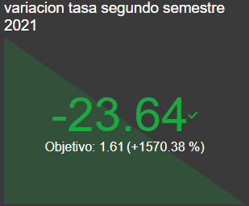
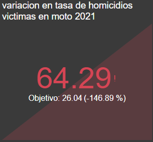

# **`Siniestros Viales en la Ciudad de Buenos Aires`**

## Contexto

En Argentina, cerca de 4.000 personas mueren cada año en siniestros viales, siendo esta la principal causa de muertes violentas en el país. Aunque muchas jurisdicciones han logrado disminuir la cantidad de accidentes de tránsito, la problemática persiste.

El objetivo principal de este proyecto fue proporcionar información clave a las autoridades locales para ayudar en la toma de medidas destinadas a reducir la cantidad de víctimas fatales de siniestros viales.

## Herramientas

- Python
- Pandas
- Power BI
- Git

## Recursos

- [Dataset Lesiones](https://data.buenosaires.gob.ar/dataset/victimas-siniestros-viales)
- [Dataset Homicidios](https://data.buenosaires.gob.ar/dataset/victimas-siniestros-viales)
- [Dataset PDE (Población Total Estimada)](https://www.estadisticaciudad.gob.ar/eyc/?p=76599)

### informacion complementaria
-[Victimas de homicidios dolosos](https://www.indec.gob.ar/indec/web/Nivel4-Tema-4-34-108)
-[Victimas de lesiones dolosas](https://www.indec.gob.ar/indec/web/Nivel4-Tema-4-34-108)
-[Investigaciones de seguridad vial Buenos Aires](https://buenosaires.gob.ar/jefaturadegabinete/movilidad/investigaciones-de-seguridad-vial)
-[Estudios Observatorio vial nacional][https://www.argentina.gob.ar/seguridadvial/observatoriovialnacional/estudios]

## El Proceso

Hemos realizado un análisis de datos utilizando los conjuntos de datos de homicidios y lesiones, que contienen información detallada sobre siniestros viales en la Ciudad de Buenos Aires. El conjunto de datos de homicidios abarca el periodo de 2016 a 2021, mientras que el de lesiones abarca de 2019 a 2021. Ambos archivos contienen dos hojas llamadas "hechos" y "víctimas", complementadas con dos hojas adicionales que sirven como diccionarios de datos para facilitar la comprensión de la información compartida.

Este análisis se llevó a cabo en un archivo llamado `EDA.ipynb`, donde se incluyen análisis básicos de los datos, gráficos y explicaciones sobre ciertos comportamientos observados.

También disponemos de un archivo de ETL, donde, aunque no realizamos la limpieza de los conjuntos de datos (realizada en Power BI), trabajamos con el archivo adicional PDE para obtener una población con la cual calcular los KPIs. También se explica el proceso de creación de archivos adicionales que contemplan ciertos datos para llevar los KPIs a Power BI.

### KPI's

El dashboard presenta dos KPIs:

1. **Objetivo de Reducción de Homicidios:**
   - Objetivo: Reducir en un 10% la tasa de homicidios en siniestros viales de los últimos seis meses en CABA, en comparación con la tasa del semestre anterior (año 2021).
   - Resultado: El objetivo no se logró, ya que se registró un aumento en los homicidios en siniestros viales donde las víctimas viajaban en moto.
     
   

2. **Objetivo de Reducción de Accidentes Mortales de Motociclistas:**
   - Objetivo: Reducir en un 7% la cantidad de accidentes mortales de motociclistas en el último año en CABA, en comparación con el año anterior (2020-2021).
   - Resultado: El objetivo no se cumplió, ya que se registró un aumento en los homicidios en siniestros viales donde las víctimas iban en moto.
     
   

## contacto

<a href="https://github.com/tDelbarco">mi perfil de github</a>
 
<a href="https://www.linkedin.com/in/tomás-del-barco-b74337229/">mi perfil de linkedin</a>
